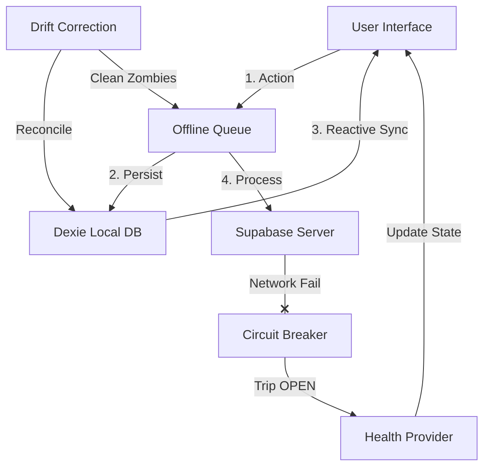

# 🛡️ Caba Self-Healing Architecture Walkthrough

This document outlines the implementation of the **Self-Healing System Architecture** in the Caba Messaging App. This architecture is designed to provide OS-level stability, ensuring the app remains functional and data remains consistent even under extreme network conditions, crashes, or server instability.

---

## 1. High-Level Concept: The Biological Metaphor

We have transformed the app from a standard "Happy Path" application into a resilient organism:

*   **The Muscles (Offline Queue):** Executes atomic tasks with guaranteed delivery.
*   **The Nervous System (Health Provider):** Monitors system health and controls the **Circuit Breaker**.
*   **The Immune System (Drift Correction):** Periodically reconciles local data with the server to patch gaps.
*   **Visual Healing (UI Feedback):** Keeps the user informed and calm during background repair cycles.

---

## 2. Architectural Data Flow

---

## 3. Core Components

### 🦾 The Muscles: `offlineQueue.js`
Every mutation (sending messages, marking read, creating groups) is now an **Atomic Task**.
*   **Idempotency:** Each task has a UUID. If the server receives the same UUID twice, it ignores the second one, preventing duplicate messages.
*   **Exponential Backoff:** If a request fails, the queue waits before retrying (1s, 2s, 4s... 30s), preventing the "Thundering Herd" effect on the server.
*   **Task Dependencies:** If Task B depends on Task A (e.g., sending a message in a group that hasn't been created yet), B waits for A to complete.

### 🧠 The Nervous System: `HealthProvider.jsx`
A global monitor that calculates a **System Health Score (0-100%)**.
*   **Circuit Breaker:** If 3 consecutive failures occur, the circuit trips to **OPEN**. In this state, the app throttles expensive network requests to allow the system to "cool down".
*   **Admin Debug HUD:** Accessible via a **3-finger long tap**. It shows real-time metrics:
    *   Health Score & Circuit State
    *   Queue Depth (Pending/Processing tasks)
    *   Daily Trip Analytics (How many times the server failed today)

### 🛡️ The Immune System: `driftCorrectionService.js`
Runs in the background every few minutes.
*   **Zombie Recovery:** Resets tasks stuck in "processing" state (due to an app crash) back to "pending".
*   **Snapshot Reconciliation:** Fetches the last 20 messages for active chats from Supabase and compares them with Dexie. If any are missing (due to missed realtime events), it patches them into local storage.

---

## 4. Visual Healing & User Experience

We don't just fix things; we show the user that the app is "healing" itself.

| UI Element | Meaning |
| :--- | :--- |
| **Amber Pulse Icon** | The message is currently being "repaired" (retried) in the background. |
| **Glimmer Shimmer** | The message is in the Optimistic state (sending). |
| **Purple Banner** | Circuit Breaker is active; the system is protecting itself from server errors. |
| **Blue Pulse Banner** | System is testing the connection to come back online. |

---

## 5. Summary of Key Files

1.  [`offlineQueue.js`](file:///home/aashu/caba-android-app/src/services/offlineQueue.js): Core logic for task management and backoff.
2.  [`HealthProvider.jsx`](file:///home/aashu/caba-android-app/src/contexts/HealthProvider.jsx): Global state management for system stability.
3.  [`driftCorrectionService.js`](file:///home/aashu/caba-android-app/src/services/driftCorrectionService.js): Background reconciliation and zombie cleanup.
4.  [`db.js`](file:///home/aashu/caba-android-app/src/db/db.js): Schema versioning (v13) for retry tracking.
5.  [`MessageBubble.jsx`](file:///home/aashu/caba-android-app/src/components/chat/MessageBubble.jsx): Premium animations and healing feedback.

---

**Current Status:** Deployment Complete. System is now **Fault-Tolerant**.
